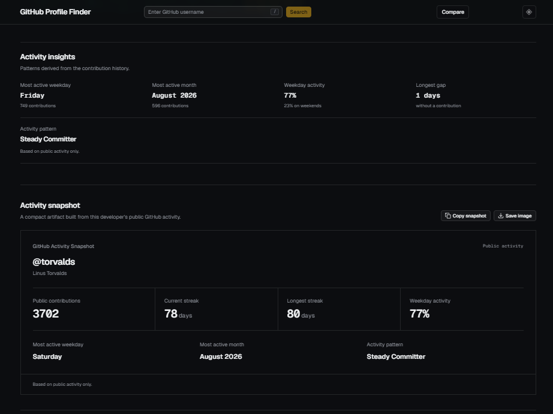
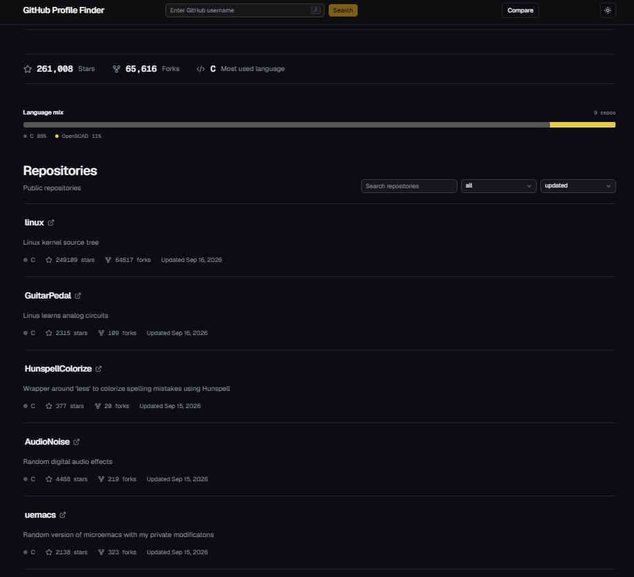
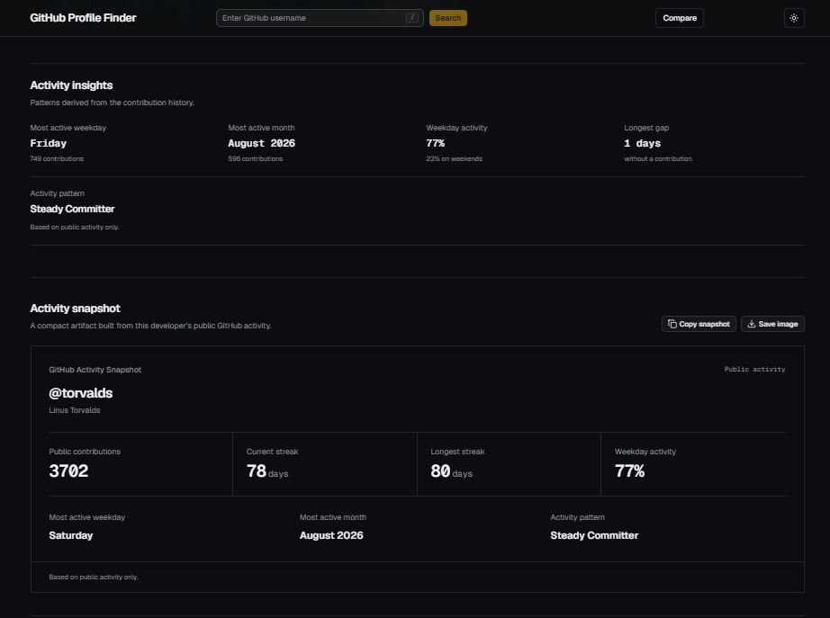
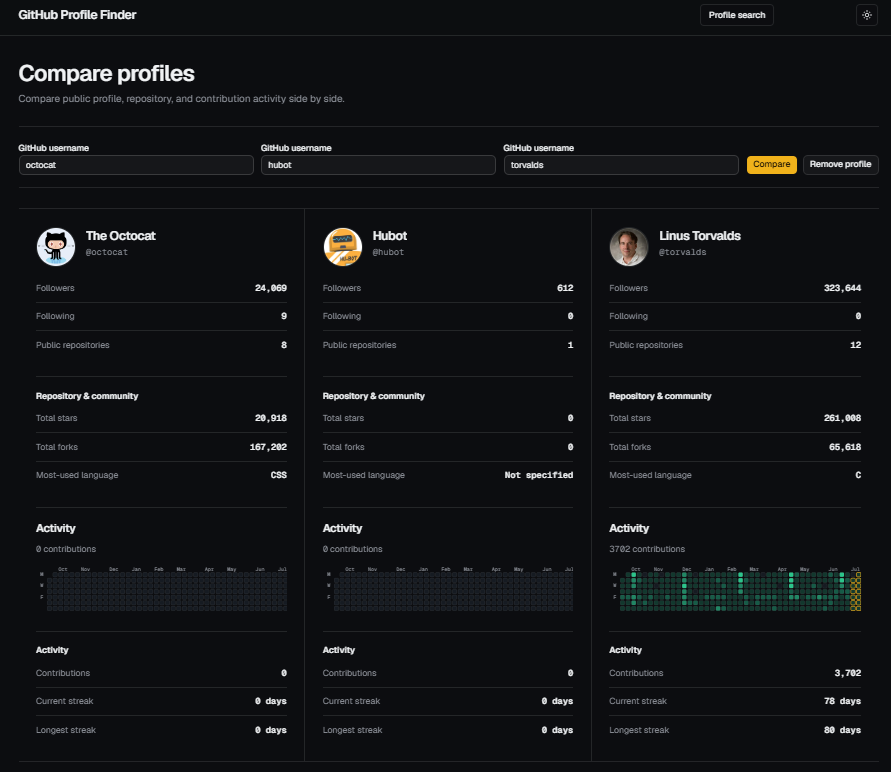
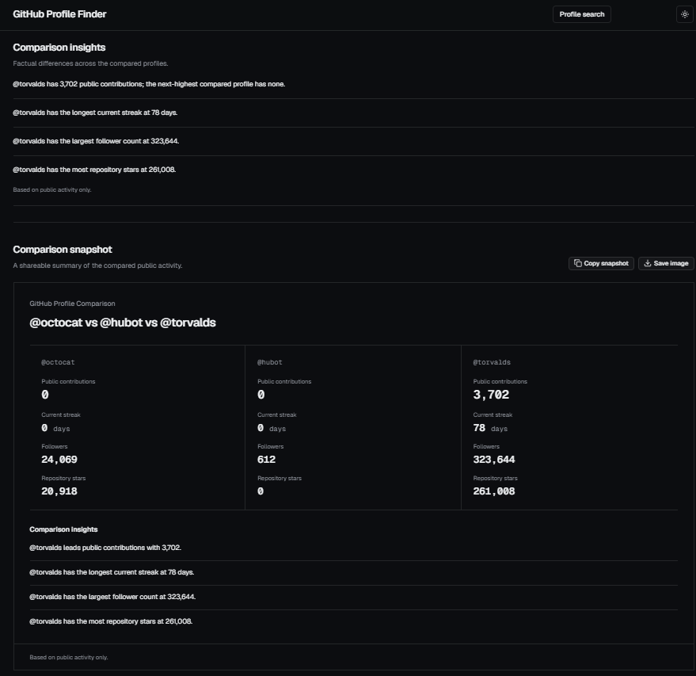

# GitHub Dashboard

A developer-activity dashboard that turns public GitHub data into a readable, analytical, and shareable profile experience.

Search a GitHub username to explore profile information, repository statistics, contribution activity, language mix, activity patterns, and shareable snapshots. Compare two or three developers side by side and surface factual differences in their public activity.

> Activity insights are based on public GitHub activity only.

### Profile dashboard



## What it does

### Profile analysis

Search any GitHub username and view:

- Profile information and public statistics
- Contribution activity across the last year
- Current and longest contribution streaks
- Repository statistics
- Repository language distribution
- Searchable and sortable repositories



### Activity intelligence

The dashboard goes beyond displaying contribution data by deriving patterns from contribution history:

- Most active weekday
- Most active month
- Weekday vs weekend activity
- Longest contribution gap
- Activity archetype such as `Sprint Coder`, `Weekend Warrior`, `Steady Committer`, or `Consistent Contributor`

All interpreted activity is explicitly presented as being based on public activity only.



### Compare profiles

Compare two or three GitHub profiles side by side.

The comparison includes:

- Followers
- Following
- Public repositories
- Repository stars and forks
- Most-used language
- Contribution totals
- Current streaks
- Longest streaks
- Compact contribution graphs
- Factual comparison insights

The comparison intentionally avoids subjective claims such as declaring one developer "better".





### Shareable snapshots

Turn analysis into something worth keeping.

Single-profile snapshots can be:

- Copied as formatted text
- Saved as a PNG image

Comparison snapshots can also be:

- Copied as formatted text
- Saved as a PNG image

## Tech stack

### Frontend

- React
- Vite
- Tailwind CSS
- shadcn/ui
- Lucide React

### Backend

- Node.js
- Express
- GitHub REST API
- GitHub GraphQL API

### Engineering

- Shared JavaScript data-processing modules
- Automated Node.js tests
- Production Vite build
- Responsive layouts
- Keyboard-accessible interactions
- Light and dark themes

## Project structure

```text
github-dashboard/
├── client/
│   ├── src/
│   │   ├── components/
│   │   ├── services/
│   │   └── utils/
│   └── ...
├── shared/
│   ├── contributionCalendar.js
│   ├── contributionStats.js
│   ├── activityArchetype.js
│   ├── activityInsights.js
│   └── shareableSnapshot.js
├── test/
├── package.json
└── README.md
```

## Getting started

### Prerequisites

- Node.js
- npm
- A GitHub personal access token configured as `GITHUB_TOKEN`

### Installation

Clone the repository and install dependencies:

```bash
git clone https://github.com/mohdriyaan/github-dashboard.git
cd github-dashboard
npm install
cd client
npm install
cd ../server
npm install
```

### Environment Variables

Create a .env file inside the server directory:

```env
GITHUB_TOKEN=your_github_token
```

The token is used by the backend when requesting contribution data through GitHub's GraphQL API.

### Run the project

Start the backend and frontend according to the project's development scripts.

The frontend is built with Vite and the root project delegates production builds to the client package.

### Testing

Run the complete test suite from the project root:

```bash
npm test
```

Build the production frontend:

```bash
npm run build
```

Run linting:

```bash
npm run lint
```

## Design principles

The project is intentionally designed around a few principles:

*Data before decoration*
Every major UI element should communicate useful information.

*Interpretation over repetition*
The dashboard should derive meaningful patterns instead of simply repeating raw GitHub fields.

*Shareable output*
Important analysis should be capable of becoming an artifact that can be copied or saved.

*Public-data transparency*
Interpretations are clearly identified as being based on public activity.

*Responsive by default*
Dense data such as contribution graphs remains usable on smaller screens rather than being forced into an unreadable layout.

*Accessible interaction*
Keyboard navigation, visible focus states, semantic labels, and loading/error feedback are treated as part of the product rather than an afterthought.

## Roadmap

Potential future improvements include:

- More analytical activity signals
- Additional snapshot formats
- Persistent comparison links
- Improved repository analytics
- Historical activity comparisons

## Author

Mohammed Riyaan

GitHub: https://github.com/mohdriyaan